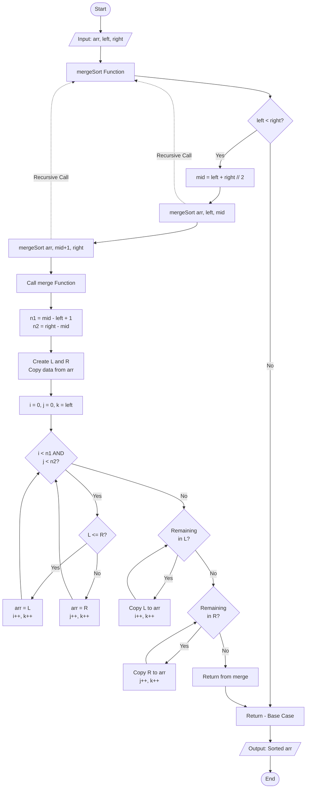

<h1>Merge Sort Visualizer</h1>

  <b><i>A Python application for visually interactive algorithm simulation.</i></b>
   
  <b><i>Developed for CISC-121 at Queen's University.</i></b>

---

## 🚀 Objective
The goal of this project is to create a Python app that demonstrates the **Merge Sort** algorithm in a visually interactive way using a graphical user interface. This application showcases computational thinking, algorithm design, testing, documentation skills, and knowledge of sorting algorithms.

## 📦 Project Deliverables

| File | Description |
| :--- | :--- |
| `app.py` | The main application file |
| `requirements.txt` | List of dependencies (i.e., Python packages, e.g., Gradio) |
| `README.md` | Documentation matching marking criteria |
| **Hugging Face App** | The deployed version of the app (Linked above) |

---

## 🧠 Computational Thinking & Problem Breakdown

I chose **Merge Sort** to implement and visualize. It creates a unique decision tree and effectively demonstrates the **divide and conquer** approach. Additionally, it maintains a time complexity of $O(n \log n)$ regardless of the dataset, making it highly efficient.

### The Four Pillars

<b>1. Decomposition</b>

I broke the Merge Sort algorithm down into distinct smaller steps: the <code>mergeSort</code> function (which recursively splits the array) and the <code>merge</code> function (which compares and combines the split arrays).

<b>2. Pattern Recognition</b>

The algorithm relies on a repeating pattern of finding the middle index, dividing the list until single elements remain, and then comparing elements ($L \le R$) to swap and rebuild the sorted list.

<b>3. Abstraction</b>

The visualization abstracts away the low-level memory allocation details. It focuses on showing the user the logical flow: the input, the splitting process, and the final output, discarding unnecessary internal processing details from the visual feed.

<b>4. Algorithm Design</b>

The flow is designed as: <b>Input</b> (User provides a raw list) $\rightarrow$ <b>Processing</b> (Recursive Divide & Conquer) $\rightarrow$ <b>Output</b> (Sorted List displayed in GUI).

---

## 📊 Algorithm Flowchart

The following diagram illustrates the logic implemented in the code:

